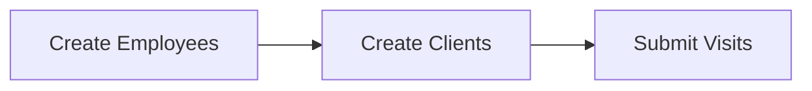

## What is an Employee?

An **Employee** (also known as caregiver, worker, staff, or home health aide) is an individual who provides home health or personal care services to clients. Employee records must be created before they can be associated with visits.

## Employee Endpoint Purpose

The Employee endpoint allows you to:
- Create new employee records
- Update existing employee information
- Manage employee contact details
- Track employee identifiers (SSN-based)
- Maintain employee status

## Endpoint URL

<CodeGroup>

```bash Production
POST https://api.sandata.com/interfaces/intake/employees/rest/api/v1.1
GET  https://api.sandata.com/interfaces/intake/employees/rest/api/v1.1/status
```

```bash UAT
POST https://uat-api.sandata.com/interfaces/intake/employees/rest/api/v1.1
GET  https://uat-api.sandata.com/interfaces/intake/employees/rest/api/v1.1/status
```

</CodeGroup>

## Key Concepts

### Employee Identifiers

Employees are identified using SSN-based identifiers:

<CardGroup cols={2}>
  <Card title="EmployeeSSN" icon="fingerprint">
    4 generic leading digits + last 5 digits of SSN
    Format: 000012345
  </Card>
  <Card title="EmployeeIdentifier" icon="id-card">
    Must match EmployeeSSN format
  </Card>
  <Card title="EmployeeOtherID" icon="tag">
    Your system's internal employee ID (optional)
  </Card>
  <Card title="EmployeeQualifier" icon="key">
    Must be "EmployeeSSN" (mixed case)
  </Card>
</CardGroup>

### Required Information

Every employee must have:
- ✅ Valid SSN-based identifier (9 digits)
- ✅ First and last name
- ✅ Sequence ID for versioning
- ✅ Provider identification

### Optional Information

You can also provide:
- Email address (conditional - required if available)
- Additional employee ID from your system

## Data Structure

```json
{
  "ProviderIdentification": {
    "ProviderQualifier": "MedicaidID",
    "ProviderID": "123456789"
  },
  "EmployeeQualifier": "EmployeeSSN",
  "EmployeeIdentifier": "000012345",
  "EmployeeOtherID": "EMP001",
  "SequenceID": 1,
  "EmployeeSSN": "000012345",
  "EmployeeLastName": "Smith",
  "EmployeeFirstName": "John",
  "EmployeeEmail": "john.smith@example.com"
}
```

## Workflow

<Steps>
  <Step title="Prepare Employee Data">
    Gather employee information including SSN-based identifier and name
  </Step>
  
  <Step title="Submit Employee">
    POST employee data to the endpoint with SequenceID = 1
  </Step>
  
  <Step title="Receive UUID">
    API returns a UUID for tracking the submission
  </Step>
  
  <Step title="Check Status">
    Wait 5 minutes, then GET status using the UUID
  </Step>
  
  <Step title="Handle Results">
    If successful, employee is ready for visit submission. If rejected, fix errors and resubmit with incremented SequenceID
  </Step>
</Steps>

## Common Use Cases

<AccordionGroup>
  <Accordion title="New Employee Onboarding">
    When a new caregiver joins:
    1. Create employee record with SequenceID = 1
    2. Include name and SSN-based identifier
    3. Add email if available
    4. Verify successful creation before assigning visits
  </Accordion>
  
  <Accordion title="Email Update">
    When an employee's email changes:
    1. Retrieve current employee data
    2. Update email address
    3. Increment SequenceID
    4. Submit complete employee record
  </Accordion>
  
  <Accordion title="Name Correction">
    When an employee's name needs correction:
    1. Update first or last name
    2. Increment SequenceID
    3. Submit complete employee record
    4. Ensure name follows validation rules
  </Accordion>
</AccordionGroup>

## Validation Rules

<Warning>
  **Critical Validation Requirements**
</Warning>

### Name Validation
- First and last names are required
- Only letters, hyphens, periods, and apostrophes allowed
- Max 30 characters each
- No numbers or special characters

### SSN Format
- Must be exactly 9 digits
- Format: 4 leading digits + 5 SSN digits
- Example: 000012345
- EmployeeIdentifier and EmployeeSSN must match

### Email Validation
- Required if provided (conditional)
- Must contain "@" symbol
- Must have valid extension (.com, .org, etc.)
- Max 64 characters

### Sequence Validation
- First submission: SequenceID = 1
- Updates: Increment SequenceID
- Duplicate SequenceID will be rejected

## Error Handling

Common rejection reasons:

| Error | Cause | Solution |
|-------|-------|----------|
| Missing SSN | EmployeeSSN not provided | Add 9-digit SSN format |
| Invalid Name | Special characters in name | Remove invalid characters |
| Missing Name | First or last name not provided | Add required name fields |
| Duplicate Sequence | SequenceID already used | Increment SequenceID |
| Invalid Email | Email format incorrect | Fix email format with @ and extension |

## Performance Considerations

<Info>
  **Best Practices for Employee Submissions**
</Info>

- **Batch Size**: Submit 1-5,000 employees per transaction
- **Frequency**: Submit new/updated employees daily or in near real-time
- **Dependencies**: Create employees before submitting visits
- **Processing Time**: Typically 30 seconds to 5 minutes
- **Status Check**: Wait 5 minutes before checking status

## Submission Order

<Warning>
  **Important**: Employees must be created before visits that reference them.
</Warning>



If you submit a visit with an unknown EmployeeIdentifier, the visit will be rejected with "Worker not found" error.

## Field Count

The Employee endpoint is the simplest of the three endpoints:

- **Total Fields**: ~14
- **Required Fields**: 8
- **Optional Fields**: 6
- **Complexity**: Low (compared to Client: 40+ fields, Visit: 50+ fields)
