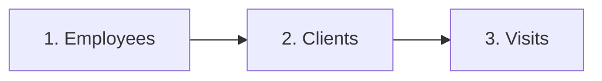

## Overview

The CT EVV API provides three main endpoints for submitting Electronic Visit Verification data to the Sandata Aggregator system.

## Three Core Endpoints

<CardGroup cols={3}>
  <Card title="Clients" icon="user" href="/api-reference/client/overview">
    Member/beneficiary information
    ~40 fields
  </Card>
  <Card title="Employees" icon="id-badge" href="/api-reference/employee/overview">
    Caregiver/worker information
    ~14 fields
  </Card>
  <Card title="Visits" icon="calendar-check" href="/api-reference/visit/overview">
    EVV visit data with calls and tasks
    50+ fields
  </Card>
</CardGroup>

## API Architecture

### RESTful Design

All endpoints follow REST principles:
- **POST** - Create or update records
- **GET** - Check processing status
- **JSON** - Request and response format
- **HTTPS** - Secure transmission (TLS 1.2+)

### Two-Step Process

<Steps>
  <Step title="POST Data">
    Submit client, employee, or visit data
    
    Returns: UUID for tracking
  </Step>
  
  <Step title="GET Status">
    Check processing status using UUID
    
    Returns: Success, processing, or errors
  </Step>
</Steps>

## Base URLs

<Tabs>
  <Tab title="Production">
    ```
    https://api.sandata.com/interfaces/intake/
    ```
    
    - **Clients**: `/clients/rest/api/v1.1`
    - **Employees**: `/employees/rest/api/v1.1`
    - **Visits**: `/visits/rest/api/v1.1`
  </Tab>
  
  <Tab title="UAT">
    ```
    https://uat-api.sandata.com/interfaces/intake/
    ```
    
    - **Clients**: `/clients/rest/api/v1.1`
    - **Employees**: `/employees/rest/api/v1.1`
    - **Visits**: `/visits/rest/api/v1.1`
  </Tab>
</Tabs>

## Authentication

All requests require:

```bash
Authorization: Basic <base64(username:password)>
Account: <your_account_id>
Content-Type: application/json
```

See [Authentication](/authentication) for details.

## Data Submission Order

<Warning>
  **Critical**: Submit data in this order to avoid rejections
</Warning>



Visits require both employee and client to exist in the system.

## Common Patterns

### Batch Submission

```json
[
  {
    // Record 1
  },
  {
    // Record 2
  },
  {
    // Record 3
  }
]
```

- Minimum: 1 record
- Maximum: 5,000 records
- Format: JSON array

### Sequence Management

```json
{
  "ClientOtherID": "CLI001",
  "SequenceID": 1  // First submission
}

// Update
{
  "ClientOtherID": "CLI001",
  "SequenceID": 2  // Increment for updates
}
```

### Status Checking

```javascript
// 1. Submit data
const postResponse = await fetch(endpoint, {
  method: 'POST',
  body: JSON.stringify(data)
});
const { data: { uuid } } = await postResponse.json();

// 2. Wait 5 minutes
await new Promise(resolve => setTimeout(resolve, 5 * 60 * 1000));

// 3. Check status
const statusResponse = await fetch(`${endpoint}/status?uuid=${uuid}`);
const status = await statusResponse.json();
```

## Response Format

All responses follow this structure:

```json
{
  "id": "uuid-here",
  "status": "SUCCESS" | "FAILED",
  "messageSummary": "Description",
  "data": {
    // Response data or errors
  }
}
```

## Error Handling

### Validation Errors

```json
{
  "status": "FAILED",
  "messageSummary": "[2] Records uploaded, please check errors/warnings and try again.",
  "data": [{
    // Rejected record with error details
    "ErrorCode": "-100",
    "ErrorMessage": "ERROR: Field is required"
  }]
}
```

### Common Error Codes

| Code | Meaning |
|------|---------|
| `-100` | Missing required field |
| `-101` | Invalid format |
| `-103` | Invalid characters |
| `-709` | Duplicate sequence |
| `-710` | Record not found |

## Rate Limits & Performance

- **Transaction Size**: 1-5,000 records
- **Processing Time**: 30 seconds to 5 minutes
- **Status Check Interval**: Wait 5 minutes between checks
- **UUID Expiration**: 48 hours

