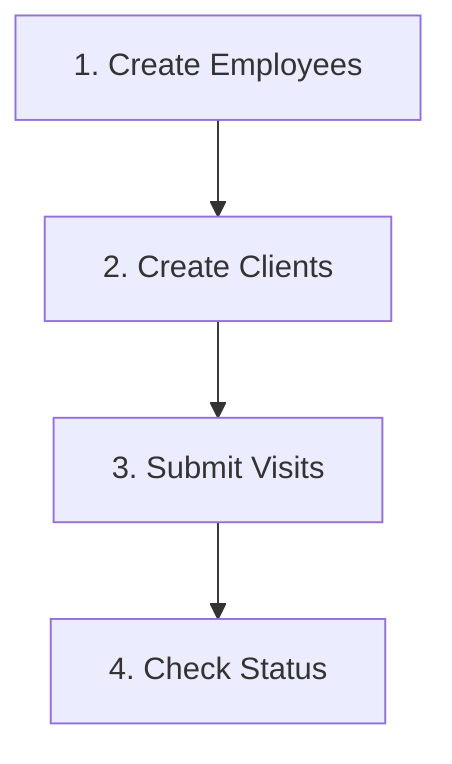

## Overview

The CT EVV API enforces strict business rules to ensure data quality and compliance. This section documents all validation rules, conditional requirements, and "if-then" logic.

<Warning>
  **Critical**: Understanding these rules is essential for successful data submission. Records that violate business rules will be rejected.
</Warning>

## General Processing Rules

### Required vs Optional vs Conditional

<Tabs>
  <Tab title="Required">
    **Required** fields must always have a value. Missing or null required fields will cause rejection.
    
    Example:
    ```json
    {
      "ClientFirstName": "John",  // Required - must have value
      "ClientLastName": "Doe"      // Required - must have value
    }
    ```
  </Tab>
  
  <Tab title="Optional">
    **Optional** fields can be omitted or sent as null without causing rejection.
    
    Example:
    ```json
    {
      "ClientMiddleInitial": "M",  // Optional - can be null
      "ClientSSN": null             // Optional - can be omitted
    }
    ```
  </Tab>
  
  <Tab title="Conditional">
    **Conditional** fields are required only when certain conditions are met.
    
    Example:
    ```json
    {
      "CallType": "Mobile",
      "CallLatitude": 41.7658,    // Required when CallType = Mobile
      "CallLongitude": -72.6734,  // Required when CallType = Mobile
      "MobileLogin": "user@example.com"  // Required when CallType = Mobile
    }
    ```
  </Tab>
</Tabs>

### Field Length Validation

<AccordionGroup>
  <Accordion title="String Fields">
    If a string field exceeds maximum length:
    - **Action**: Field will be truncated to maximum length
    - **Exception**: Some critical fields will cause rejection instead
    
    ```json
    // Max length: 30 characters
    "ClientFirstName": "VeryLongFirstNameThatExceedsThirtyCharacters"
    // Result: Truncated to "VeryLongFirstNameThatExceeds"
    ```
  </Accordion>
  
  <Accordion title="Numeric Fields">
    Numeric fields must:
    - Contain only digits (unless decimal)
    - Not exceed specified length
    - Match expected format
    
    ```json
    "ClientMedicaidID": "123456789"  // Must be exactly 9 digits
    "SequenceID": 12345              // Max 16 digits
    ```
  </Accordion>
  
  <Accordion title="Special Characters">
    Many fields restrict special characters:
    
    **Names** (First, Last):
    - ✅ Allowed: Letters, hyphens (-), periods (.), apostrophes (')
    - ❌ Rejected: Numbers, @, #, $, %, etc.
    
    **Addresses**:
    - ✅ Allowed: Letters, hyphens (-), periods (.), hash (#), apostrophes ('), underscores (_), spaces
    - ❌ Rejected: @, $, %, etc.
  </Accordion>
</AccordionGroup>

## Sequencing Rules

### Basic Sequence Logic

<Steps>
  <Step title="First Submission">
    Use SequenceID = 1 for the first submission of any record
    
    ```json
    {
      "ClientOtherID": "CLI001",
      "SequenceID": 1  // First time sending this client
    }
    ```
  </Step>
  
  <Step title="Updates">
    Increment SequenceID for each update
    
    ```json
    {
      "ClientOtherID": "CLI001",
      "SequenceID": 2  // Second submission (update)
    }
    ```
  </Step>
  
  <Step title="Gaps Allowed">
    Gaps in sequence numbers are permitted
    
    ```json
    // Valid sequence: 1, 2, 5, 10, 15
    // Missing 3, 4, 6-9, 11-14 is OK
    ```
  </Step>
</Steps>

### Sequence Validation Rules

| Scenario | Current Seq | New Seq | Result |
|----------|-------------|---------|--------|
| **Normal Update** | 4 | 5 | ✅ Accepted, becomes current |
| **Duplicate** | 5 | 5 | ❌ Rejected |
| **Out of Order** | 10 | 8 | ✅ Accepted as historical (not current) |
| **Large Gap** | 5 | 100 | ✅ Accepted, becomes current |

### Timestamp as Sequence

You can use timestamps as sequence IDs:

```json
{
  "SequenceID": 20240115093045  // YYYYMMDDHHMMSS
}
```

**Rules**:
- Format: `YYYYMMDDHHMMSS` (14 digits)
- No special characters (no dashes, colons, spaces)
- Must be numeric only
- Automatically ensures uniqueness if generated correctly

## Conditional Field Requirements

### "If This, Then That" Rules

<AccordionGroup>
  <Accordion title="Call Type Dependencies">
    **If CallType = "Mobile"**, then these fields are **REQUIRED**:
    - `CallLatitude` (GPS latitude)
    - `CallLongitude` (GPS longitude)
    - `MobileLogin` (employee login)
    
    **If CallType = "Telephony"**, then these fields are **REQUIRED**:
    - `TelephonyPIN` (employee PIN)
    - `OriginatingPhoneNumber` (phone number used)
    
    **If CallType = "Manual"** or **"FVV"**:
    - GPS and telephony fields should be null
    - `VisitChanges` segment is **REQUIRED**
  </Accordion>
  
  <Accordion title="Adjusted Times Logic">
    **If AdjInDateTime OR AdjOutDateTime is provided**, then:
    - `VisitChanges` segment is **REQUIRED**
    - `ReasonCode` must be provided
    - Adjusted times supersede Call times
    
    **Time Validation Rules**:
    - If both Call and Adjusted times exist:
      - `AdjOutDateTime` must be > `AdjInDateTime`
      - `AdjOutDateTime` must be > `CallInDateTime`
      - `CallOutDateTime` must be > `AdjInDateTime`
    - If only Call times exist:
      - `CallOutDateTime` must be > `CallInDateTime`
  </Accordion>
  
  <Accordion title="Payer/Program Dependencies">
    **If PayerProgram = ABP, AUP, CHP, PCP, or MHP**, then:
    - `Tasks` segment is **REQUIRED**
    - At least one valid TaskID must be provided
    - TaskID must match program's task list
    
    **If PayerProgram = HHI, ABI, AUI, CHI, or PCI**:
    - Tasks are optional but recommended
  </Accordion>
  
  <Accordion title="Modifier Requirements">
    **If ProcedureCode requires modifiers** (see appendix), then:
    - Modifiers must be provided in order (Modifier1, then Modifier2, etc.)
    - Cannot skip modifier positions
    - Must use "NULL" for unused modifiers
    
    Example:
    ```json
    {
      "ProcedureCode": "S9123",
      "Modifier1": "TG",      // Required for this code
      "Modifier2": "TT",      // Required for this code
      "Modifier3": "NULL",    // Not used
      "Modifier4": "NULL"     // Not used
    }
    ```
  </Accordion>
  
  <Accordion title="Visit Changes Requirements">
    **VisitChanges segment is REQUIRED when**:
    - CallType = "Manual"
    - AdjInDateTime is provided
    - AdjOutDateTime is provided
    - Any visit update (SequenceID > 1)
    - Tasks are updated
    
    **When VisitChanges is provided**, these fields are **REQUIRED**:
    - `SequenceID` (of the change)
    - `ChangeMadeBy` (user identifier)
    - `ChangeDateTime` (when change was made)
    - `ReasonCode` (from approved list)
    
    **ChangeReasonMemo is REQUIRED when**:
    - ReasonCode = "22" (Other)
    - ReasonCode = "Participant Refusal"
    - CallType = "Manual"
  </Accordion>
  
  <Accordion title="Client Address Requirements">
    **If ClientAddress is provided**, then:
    - At least one address must have all required fields:
      - `ClientAddressLine1`
      - `ClientCity`
      - `ClientState`
      - `ClientZip`
    - Exactly one address must have `ClientAddressIsPrimary` = "true"
    - Multiple addresses of same type are allowed
  </Accordion>
  
  <Accordion title="BillVisit Logic">
    **If BillVisit = false**, then:
    - Visit status will be set to "Omit"
    - Visit will not be included in billing
    - Visit cannot be cancelled (must use BillVisit = false instead)
    
    **If visit has Calls AND needs to be cancelled**:
    - Cannot use `VisitCancelledIndicator` = true
    - Must send update with `BillVisit` = false
    - Then create new visit with correct data
  </Accordion>
</AccordionGroup>

## Data Dependencies

### Submission Order

<Warning>
  **Critical**: Records must be submitted in the correct order to avoid rejections.
</Warning>



<Steps>
  <Step title="Employees First">
    Submit all employees before any visits
    
    **Why**: Visits require valid EmployeeIdentifier
    
    **If violated**: Visit rejected with "Worker not found" error
  </Step>
  
  <Step title="Clients Second">
    Submit all clients before any visits
    
    **Why**: Visits require valid ClientIdentifier
    
    **If violated**: Visit rejected with "Client not found" error
  </Step>
  
  <Step title="Visits Last">
    Submit visits only after employees and clients exist
    
    **Why**: Visits link to existing employees and clients
    
    **If violated**: Visit rejected
  </Step>
</Steps>

### Cross-Record Validation

<AccordionGroup>
  <Accordion title="Employee-Visit Matching">
    **Visit EmployeeIdentifier must match**:
    - An existing employee's `EmployeeIdentifier`
    - Same `ProviderID` as the visit
    - Active employee record
    
    **Format must be consistent**:
    ```json
    // Employee record
    {
      "EmployeeQualifier": "EmployeeSSN",
      "EmployeeIdentifier": "000012345"
    }
    
    // Visit record - must match exactly
    {
      "EmployeeQualifier": "EmployeeSSN",
      "EmployeeIdentifier": "000012345"  // Must match employee
    }
    ```
  </Accordion>
  
  <Accordion title="Client-Visit Matching">
    **Visit ClientIdentifier must match**:
    - An existing client's `ClientIdentifier`
    - Same `ProviderID` as the visit
    - Active client record
    
    **Multiple identifiers must align**:
    ```json
    // Client record
    {
      "ClientIdentifier": "987654321",
      "ClientCustomID": "987654321",
      "ClientMedicaidID": "987654321"
    }
    
    // Visit record - must match
    {
      "ClientIdentifier": "987654321",
      "ClientID": "987654321"
    }
    ```
  </Accordion>
  
  <Accordion title="Payer-Program Validation">
    **PayerID and PayerProgram must be valid combinations**:
    
    Valid combinations:
    - `CTHH` + `HHI`
    - `CTDSS` + `ABI`, `AUI`, `CHI`, `PCI`, `ABP`, `AUP`, `CHP`, `PCP`
    - `CTMHW` + `MHP`
    
    Invalid combinations will be rejected.
  </Accordion>
</AccordionGroup>

## Timing and Date Rules

### UTC Requirement

<Info>
  **All dates and times must be in UTC format** (Coordinated Universal Time)
</Info>

**DateTime Format**: `YYYY-MM-DDTHH:MM:SSZ`

Example: `2024-01-15T14:30:00Z`

**Date Format**: `YYYY-MM-DD`

Example: `2024-01-15`

### Visit Timing Rules

<AccordionGroup>
  <Accordion title="Call Time Validation">
    **Basic Rule**: `CallOutDateTime` must be greater than `CallInDateTime`
    
    ```json
    {
      "Calls": [{
        "CallDateTime": "2024-01-15T09:00:00Z",  // In
        "CallAssignment": "Time In"
      }, {
        "CallDateTime": "2024-01-15T13:00:00Z",  // Out (must be > In)
        "CallAssignment": "Time Out"
      }]
    }
    ```
    
    **If violated**: Record rejected
  </Accordion>
  
  <Accordion title="Adjusted Time Validation">
    **When both Adjusted times provided**:
    - `AdjOutDateTime` must be > `AdjInDateTime`
    
    **When Adjusted + Call times provided**:
    - `AdjOutDateTime` must be > `CallInDateTime`
    - `CallOutDateTime` must be > `AdjInDateTime`
    
    ```json
    {
      "AdjInDateTime": "2024-01-15T09:00:00Z",
      "AdjOutDateTime": "2024-01-15T13:00:00Z",  // Must be > AdjIn
      "Calls": [{
        "CallDateTime": "2024-01-15T09:10:00Z",  // Must be < AdjOut
        "CallAssignment": "Time In"
      }, {
        "CallDateTime": "2024-01-15T12:50:00Z",  // Must be > AdjIn
        "CallAssignment": "Time Out"
      }]
    }
    ```
  </Accordion>
  
  <Accordion title="Visit Submission Timing">
    **Visits should be submitted**:
    - Within 24 hours of occurrence (recommended)
    - In near real-time when possible
    - At least daily
    
    **Late submissions**:
    - Still accepted but may affect reporting
    - May trigger late submission exceptions
  </Accordion>
</AccordionGroup>

## Exception Handling

### Acknowledgeable Exceptions

Some exceptions require acknowledgement rather than correction:

**Exception ID 15**: Unmatched Client ID/Phone (Telephony)
- **Action**: Send `VisitExceptionAcknowledgement` segment
- **Required**: `ExceptionAcknowledged` = "true"

```json
{
  "VisitExceptionAcknowledgement": [{
    "ExceptionID": "15",
    "ExceptionAcknowledged": "true"
  }]
}
```

### Fix-Required Exceptions

Other exceptions require data correction and resubmission:

- **Exception 0**: Unknown Client → Submit client first
- **Exception 1**: Unknown Employee → Submit employee first
- **Exception 3**: Visit Without In-Call → Add Call segment
- **Exception 4**: Visit Without Out-Call → Add Call segment
- **Exception 23**: Missing Service → Add valid ProcedureCode

## Next Steps

<CardGroup cols={2}>
  <Card title="Client Rules" icon="user" href="/business-rules/client-rules">
    Detailed client validation rules
  </Card>
  <Card title="Employee Rules" icon="id-badge" href="/business-rules/employee-rules">
    Detailed employee validation rules
  </Card>
  <Card title="Visit Rules" icon="calendar-check" href="/business-rules/visit-rules">
    Detailed visit validation rules
  </Card>
  <Card title="Call Logic" icon="clock" href="/business-rules/call-logic">
    Call times vs Adjusted times scenarios
  </Card>
</CardGroup>
